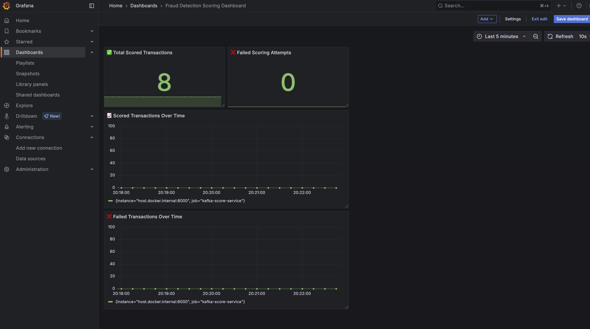

End-to-End MLOps Pipeline for Fraud Detection
=================================================

This project implements a production-grade MLOps pipeline for real-time credit card fraud detection. It ingests streaming transactions via Kafka, scores them with a LightGBM model served through MLflow, monitors activity with Prometheus + Grafana, and supports automated model retraining using Apache Airflow.

>  **Stack**: Apache Kafka, Spark Streaming, MLflow, Airflow, LightGBM, Prometheus, Grafana, Docker, Python

* * *

 Features
-----------

* **Real-time scoring** of streaming transactions
    
*  **LightGBM model training + evaluation** on the IEEE-CIS dataset
    
*  **MLflow model serving and registry** with versioning
    
*  **Auto-retraining pipeline** triggered daily (Airflow DAG)
    
*  **Monitoring** with Prometheus & Grafana dashboards
    
*  Fully **containerized** with Docker Compose
    

* * *

 Folder Structure
-------------------

```bash
├── kafka/                 # Kafka producer and scoring consumer
├── model/                 # Training + promotion logic
├── airflow/               # DAGs, logs, Airflow configs
├── docker/                # Dockerfiles + Compose setup
├── mlruns/                # MLflow run artifacts
├── architecture/          # Architecture diagrams (.drawio, .svg, .gif)
├── data/                  # Raw dataset (IEEE-CIS Fraud Detection)
├── spark/                 # Spark streaming consumer
└── README.md              # This file
```

* * *

 Architecture
----------------


* * *

Pipeline Overview
--------------------

1. **Kafka** producer streams batches from `train_transaction.csv`
    
2. **Spark** or **Python KafkaConsumer** scores transactions using a live MLflow model
    
3. **MLflow** logs runs, metrics, and model artifacts (LightGBM)
    
4. **Airflow** DAG retrains the model daily and promotes if better
    
5. **Prometheus + Grafana** monitor metrics like scoring volume and failures
    

* * *

Setup & Run
--------------

### 1. Add Dataset

Download the IEEE-CIS dataset and place it in `./data/`.

### 2. Start Services

```bash
cd docker
docker-compose up --build
```

### 3. Train Initial Model

```bash
python model/train_model.py
```

Model is registered in MLflow and promoted to Staging.

### 4. Start Streaming & Scoring

```bash
python kafka/producer.py --file data/fraud_sample.csv --topic raw-transactions
python kafka/kafka_score.py
```

* * *

Monitoring
-------------

* **MLflow UI** → [http://localhost:5001](http://localhost:5001)
    
* **Airflow UI** → [http://localhost:8080](http://localhost:8080)
    
* **Prometheus** → [http://localhost:9090](http://localhost:9090)
    
* **Grafana** → [http://localhost:3000](http://localhost:3000)
    

> Default credentials: `admin` / `admin`

* * *

Retraining Logic (Airflow)
-----------------------------

* DAG: `retrain_fraud_model`
    
* Tasks:
    
    * `retrain_model`: runs `train_model.py`
        
    * `promote_if_better`: compares new ROC AUC with existing and promotes model if better
        

* * *

 Sample Grafana Dashboard
---------------------------


* * *

 Key Learnings
----------------

* Built a reliable CI/CD pipeline for ML workflows
    
* Hands-on with MLflow Registry, Airflow DAGs, and Kafka stream integration
    
* Exposed custom Prometheus metrics using `prometheus_client` in Python
    

* * *

 References
-------------

* IEEE-CIS Fraud Detection Dataset
    
* [MLflow Documentation](https://mlflow.org/)
    
* [Apache Airflow Docs](https://airflow.apache.org/)
    
* [Kafka Python](https://kafka-python.readthedocs.io/)
    

* * *

 Future Improvements
---------------------

* Add concept drift detection (e.g., via `evidently`)
    
* Integrate alerting in Grafana
    

    

    

* * *

👨‍💻 Author
------------

**Tribhangin Dichpally**  
Email: tribhangin@gmail.com  


* * *