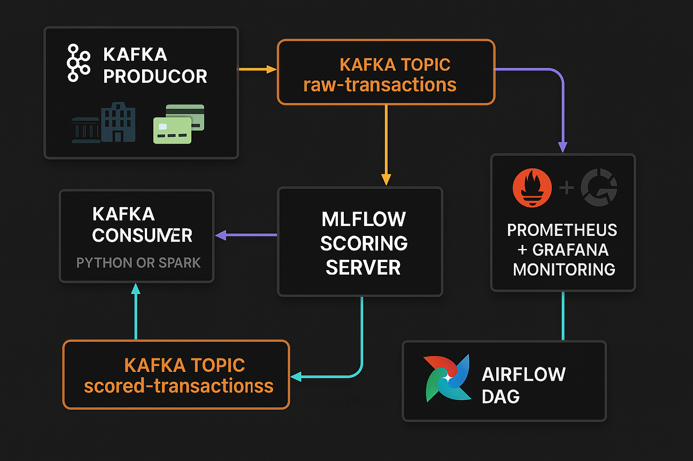

# 🔍 End-to-End MLOps Pipeline for Real-Time Fraud Detection

A fully containerized MLOps project for **real-time credit card fraud detection** — built with Kafka, Airflow, MLflow, Prometheus, and Grafana.

> Production-ready scoring + monitoring + auto-retraining

---

## 💡 Project Highlights

- ⚡ **Real-time inference** with Kafka producers and consumers  
- 🎯 **LightGBM model** trained on IEEE-CIS dataset  
- 🔁 **Airflow DAG** for daily retraining and model promotion  
- 📦 **MLflow Registry** for model tracking, versioning, and serving  
- 📊 **Prometheus & Grafana dashboards** for latency, error rate, and volume  
- 🐳 Fully dockerized, CI/CD-ready

---

## 📂 Project Structure

```bash
├── kafka/          # Kafka producer and scoring consumer
├── model/          # Training and model registry logic
├── airflow/        # DAGs for retraining and promotion
├── grafana/        # Dashboard provisioning configs
├── docker/         # Dockerfiles + docker-compose + prometheus.yml
├── data/           # IEEE-CIS dataset
├── architecture/   # Diagrams: system + dashboard
├── mlruns/         # MLflow run artifacts
└── README.md       # You're here
```

---

## 🛠️ Tech Stack

| Component     | Tool                                      |
|---------------|-------------------------------------------|
| Model         | LightGBM                                  |
| Serving       | MLflow (REST API)                         |
| Streaming     | Apache Kafka                              |
| Retraining    | Apache Airflow (daily DAG)                |
| Monitoring    | Prometheus + Grafana                      |
| Orchestration | Docker Compose                            |
| Dataset       | [IEEE-CIS Fraud Detection](https://www.kaggle.com/competitions/ieee-fraud-detection) |

---

## 🧭 Architecture

### System Flow



1. Kafka producer streams batches from `train_transaction.csv`
2. Kafka consumer scores each message using MLflow model
3. Prometheus scrapes metrics from the scoring service
4. Grafana visualizes scoring metrics + model version
5. Airflow retrains daily and promotes new model if ROC AUC improves

---

## 🚀 Getting Started

### 1. Add Dataset

Place `train_transaction.csv` and `train_identity.csv` in `./data/`.

---

### 2. Start Services

```bash
cd docker/
docker-compose up --build
```

Starts:
- Kafka (w/ Zookeeper)
- Prometheus + Grafana
- Airflow (scheduler + webserver)
- MLflow tracking server

---

### 3. Train Initial Model

```bash
python model/train_model.py
```

- Logs metrics + artifacts to MLflow
- Registers model to `Staging` in Model Registry

---

### 4. Start Streaming & Scoring

```bash
python kafka/producer.py --file data/fraud_sample.csv --topic raw-transactions
python kafka/kafka_score.py
```

- Scoring results sent to `scored-transactions` topic
- Prometheus metrics exposed at `localhost:8000/metrics`

---

## 📊 Observability

| Tool        | URL                       | Login      |
|-------------|----------------------------|------------|
| **MLflow**  | `http://localhost:5001`    | —          |
| **Airflow** | `http://localhost:8080`    | `airflow` / `airflow` |
| **Prometheus** | `http://localhost:9090` | —          |
| **Grafana** | `http://localhost:3000`    | `admin` / `admin` |

---

## 📈 Grafana Dashboards

Auto-provisioned with panels for:

- ✅ Total Scored Transactions  
- ❌ Failed Transactions  
- 📉 Error Rate  
- ⏱️ Latency (ms)  
- 🔁 Model Version  
- 📊 Daily Predictions  

> Dashboard auto-imported from `grafana/provisioning/` at startup.

---

## 🔁 Auto-Retraining (Airflow)

- DAG: `retrain_fraud_model`
- Tasks:
  - `retrain_model`: Trains model + logs to MLflow
  - `promote_if_better`: Promotes new model if ROC AUC improves
- Runs daily via `@daily` schedule

---

## 📏 Custom Prometheus Metrics

From `kafka_score.py`:

- `scored_transactions_total`
- `failed_transactions_total`
- `scoring_latency_seconds`

> Used in Grafana to visualize system health in real-time

---

## 🧠 Learnings

- ✅ End-to-end MLOps orchestration from training → serving → monitoring
- ✅ Integrated Prometheus/Grafana for metric visibility
- ✅ Built MLflow + Airflow + Kafka into a scalable retraining loop
- ✅ Hands-on with metric-based model promotion logic

---

## 🧰 Optional Improvements

- Concept drift detection with [`evidently`](https://evidentlyai.com/)
- Slack/email alerting via Grafana
- Export model to ONNX / TorchScript for faster inference
- Use AWS S3/MinIO for artifact storage

---

## 👨‍💻 Author

**Tribhangin Dichpally**  
📧 [tribhangin@gmail.com](mailto:tribhangin@gmail.com)

---

> ⚡ If you like this project, feel free to ⭐ the repo and fork it!
